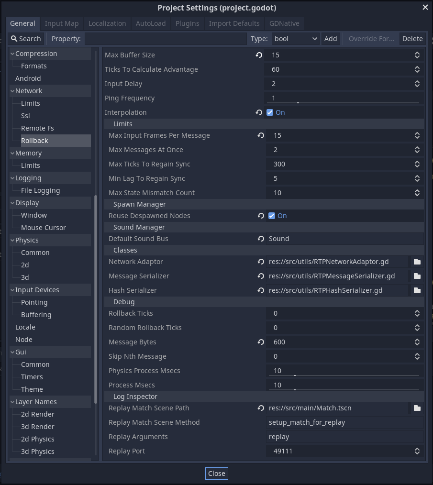
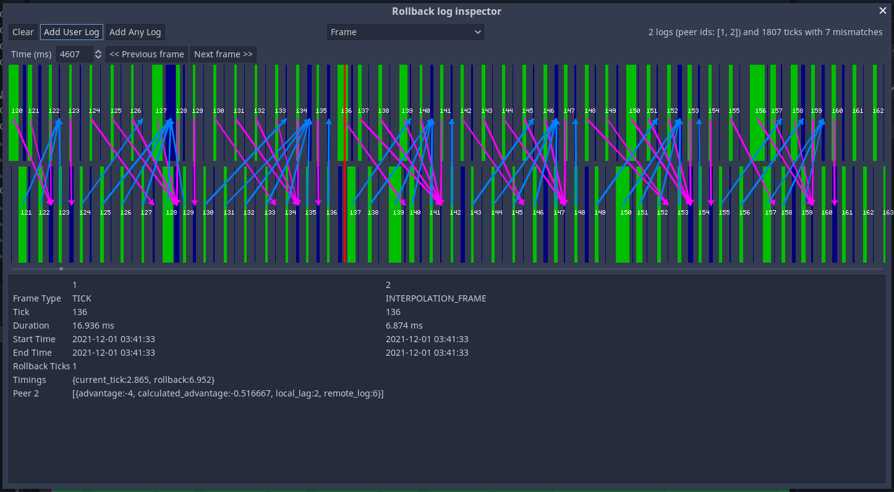

Godot Rollback Netcode
======================

This is an addon for implementing rollback and prediction netcode in the Godot
game engine.

Beyond the basics (gathering input, saving/loading state, sending messages,
detecting mismatches, etc) this library aims to provide support for many of
the other aspects of implementing rollback in a real game, including timers,
animation, random number generation, and sound - along with high-quality
debugging tools to make solving problems easier.

Implementing rollback and prediction is HARD, and so every little bit of help
is important. :-)

Tutorials
---------

I'm working on a series of video tutorials on YouTube. You check back on
[my channel](https://www.youtube.com/SnopekGames),
but I'll post a more specific link once the first video is finished!

Installing
----------

This addon is implemented as an editor plugin.

If you've never installed a plugin before, please see the
[official docs on how to install plugins](https://docs.godotengine.org/en/stable/tutorials/plugins/editor/installing_plugins.html)

However, the short version is:

1. Copy the `addons/godot-rollback-netcode` directory from this project into
your Godot project *at the exact same path*. The easiest way to do this is in
the AssetLib right in the Godot editor - search for "Godot Rollback Netcode".

2. Enable the plugin by clicking **Project** -> **Project settings...**, going
to the "Plugins" tab, and clicking the "Enable" checkbox next to "Godot
Rollback Netcode".

Games using this addon
----------------------

- [Retro Tank Party](https://www.snopekgames.com/games/retro-tank-party)

If you release a game using this addon, please make an MR (Merge Request) to
add it to the list!

Overview
--------

This is a quick overview of the different pieces that the addon includes.

### Singletons ###

- `res://addons/godot-rollback-netcode/SyncManager.gd`: This is the core of
  the addon. It will be added to your project automatically when you enable
  the plugin. It must be named `SyncManager` for everything to work
  correctly.
 
- `res://addons/godot-rollback-netcode/SyncDebugger.gd`: Adding this
  singleton will cause more debug messages to be printed to the console (and
  captured in the normal Godot logs) and make a debug overlay available. By
  default, the overlay can be shown by pressing F11, but you can assign any
  input event to the "sync_debug" action in the Input Map in your project's
  settings.

### Important properties, methods and signals on `SyncManager` ###

The `SyncManager` singleton is the core of this addon, and one of the primary
ways that your game will interact with the addon. (The other primary way is
via virtual methods that you'll implement in scripts on your nodes - see the
section called "Virtual methods" below for more information.)

#### Properties: ####

- `current_tick: int`: The current tick that we are executing. This will
  update during rollback to be the tick that is presently being re-executed.

- `input_tick: int`: The tick we are currently gathering local input for. If
  there is an input delay configured in Project Settings, this be ahead of
  `current_tick` by the number of frames of input delay. This doesn't change
  during rollback.

- `started: bool`: will be true if synchronization has started; otherwise
  it'll be false. This property is read-only - you should call the `start()`
  or `stop()` methods to start or stop synchronizing.

#### Methods: ####

- `add_peer(peer_id: int) -> void`: Adds a peer using its ID within Godot's
  [High-Level Multiplayer API](https://docs.godotengine.org/en/stable/tutorials/networking/high_level_multiplayer.html).
  Once a peer is added, the `SyncManager` will start pinging it right away.
  All peers should be added before calling `SyncManager.start()`.

- `start() -> void`: Starts synchronizing! This should only be called on the
  "host" (the peer with id 1), which will tell all the other clients to start
  as well. It's after calling this that the "Virtual methods" described below
  will start getting called.

- `stop() -> void`: Stops synchronizing. If called on the "host" (the
  peer with id 1) it will tell all the clients to stop as well.
  
- `clear_peers() -> void`: Clears the list of peers.

- `start_logging(log_file_path: String, match_info: Dictionary = {}) -> void`:
  Starts logging detailed information about the current match to the given
  log file. The common convention is to put the log files under
  "user://detailed_logs/". The `match_info` is stored at the start of the
  log, and is used when loading a replay of the match. This method should
  be called before `SyncManager.start()` or the "sync_started" signal.

- `stop_logging() -> void`: Stops logging. This method should be called
  after `SyncManager.stop()` or the "sync_stopped" signal.

- `spawn(name: String, parent: Node, scene: PackedScene, data: Dictionary = {}, rename: bool = true, signal_name: String = '') -> Node`:
  Spawns a scene and makes a "spawn record" in state so that it can be
  de-spawned or re-spawned as the result of a rollback.

  It returns the top-level node that was spawned, however, rather than doing
  most setup on the returned node, you should do it in response to the
  "scene_spawned" signal. This is because the scene could be re-spawned due
  to a rollback, and you probably want all the same setup to happen then as
  when it was originally spawned. (Note: there are rare cases when you do want
  to do setup *only* when spawned initially, and not when re-spawned.)

  * `name`: The base name to use for the top-level node that is spawned.
  * `parent`: The parent node the spawned scene will be added to.
  * `scene`: The scene to spawn.
  * `data`: Data that will be passed to `_network_spawn_preprocess()` and
    `_network_spawn()` on the top-level node. See the "Virtual methods"
    described below for more information.
  * `rename`: If true, the actual name of the top-level node that is spawned
    will have an incrementing integer appended to it. If false, it'll try to
    use the `name` but this could lead to conflicts. Only set to false if you
    know for sure that no other sibling node will use that name.
  * `signal_name`: If provided, this is the name that'll be passed to the
    "scene_spawned" signal; otherwise the `name` will be used.

- `despawn(node: Node) -> void`: De-spawns a node that was previously
  spawned via `SyncManager.spawn()`. It calls `_network_despawn()` and removes
  the "spawn record" in state.  By default, this will also remove the node
  from its parent and call `node.queue_free()`. However, if you have enabled
  "Reuse despawned nodes" in Project Settings, then the node will be saved and
  reused when the same scene needs to be spawned later. This makes it
  especially important to clean-up the nodes internal state in
  `_network_despawn()` so that the node is "like new" when reused.

- `play_sound(identifier: String, sound: AudioStream, info: Dictionary = {}) -> void`:
  Plays a sound and records that we played this specific sound on the
  current tick, so that we won't play it again if we re-execute the same
  tick again due to a rollback.
  * `identifier`: A unique identifier for the sound. Only one sound with this
    identifier will be played on the current tick. The common convention is
    to use the node path of the node playing the sound, with some sort of
    "tag" appended, for example:
    ```
    SyncManager.play_sound(str(get_path()) + ':shoot', shoot_sound)
    ```
  * `sound`: The sound resource to play.
  * `info`: A set of optional parameters, including:
    - `position`: A `Vector2` giving the position the sound should originate
      from. If omitted, positional audio won't be used.
    - `volume_db`: A `float` giving the volume in decibels.
    - `pitch_scale`: A `float` to scale the pitch.
    - `bus`: The name of the bus to play the sound to. If none is given, the
      default bus configured in Project Settings will be used.

#### Signals: ####

- `sync_started ()`: Emitted when synchronization has started, as a result of
  `SyncManager.start()` on the "host".

- `sync_stopped ()`: Emitted when synchronization has stopped for any reason -
  it could be due to an error (in which case "sync_error" will have been
  emitted before this signal) or `SyncManager.stop()` being called locally or
  on the "host".

- `sync_lost ()`: Emitted when this client has gone far enough out of sync with
  the other clients that we need to pause for a period of time and attempt to
  regain synchronization. Your game should show some indication (a message or
  loading icon) to the player so that they know why the match has suddenly
  come to a stop.

- `sync_regained ()`: Emitted if we've managed to regain sync after it had been
  lost. The message or icon your game showed to the player when "sync_lost" was
  emitted should be removed.

- `sync_error (msg: String)`: Emitted when a fatal synchronization error has
  occurred and the match cannot continue. This could be for a number of
  reasons, which will be identified in a human-readable message in `msg`.

- `scene_spawned (name: String, spawned_node: Node, scene: PackedScene, data: Dictionary)`:
  Emitted when a scene is spawned via `SyncManager.spawn()` or re-spawned due
  to a rollback. Connect to this signal when you want to do some setup on a
  scene that was spawned, and you need to ensure that that setup also happens
  if the scene is re-spawned during rollback (you want to do this most of the
  time).

- `interpolation_frame ()`: If interpolation is enabled in Project Settings,
  the work of the `SyncManager` will be split between "tick frames" (where
  input is gathered, rollbacks are performed and ticks are executed) and
  a variable number of "interpolation frames" that happen between them.
  This signal is emitted at the end of each interpolation frame, so that
  you can perform some operations during a frame with more time budget
  to spare (a lot more needs to happen during tick frames).
 
### Node types ###

This addon include a few rollback-aware node types:

- `NetworkTimer`: A replacement for the `Timer` node. Unlike `Timer`, it
  doesn't wait for a number of seconds, but instead a number of ticks
  (the `wait_ticks` property).

  If `hash_state` is set to false, then the timer's state won't be included
  in the hash used to detect state mismatches. This is useful if a timer may
  only run on a single client, rather than on all clients.

- `NetworkAnimationPlayer`: Descends from the built-in `AnimationPlayer` but
  will only move forward each tick (rather than as time passes) and it
  supports rollback.

  If `auto_reset` is set to true, it will automatically play the "RESET"
  animation every time state is loaded without an animation playing. This can
  help prevent issues where an animation started, but on rollback it's
  determined that it shouldn't have started, so the animation is left in an
  in-between state.

- `NetworkRandomNumberGenerator`: For generating random numbers in a
  deterministic way that supports rollback. At the start of the match, the
  clients need to initialize the node with the same seed. Each time a random
  number is generated, it's internal state will change in a deterministic way,
  such that the sequence of numbers it generates on each client will be the
  same. When a rollback happens, it's internal state will rollback such that
  it'll generate the same sequence of numbers again.

  One way to avoid having to share a seed for every
  `NetworkRandomNumberGenerator` in the game, is to share a single "mother
  seed" which is used for one `NetworkRandomNumberGenerator` that
  generates all the other seeds the game needs. I like to call this the
  "Johnny Appleseed approach" where "Johnny" is distributing seeds grown from
  the "mother seed". This will work so long as the nodes are always initialized
  in a deterministic order!

### Virtual methods ###

For a node to participate in rollback, it must be in the "network_sync" group,
which will cause `SyncManager` to call various virtual methods on the node:

- `_save_state() -> Dictionary`: Returns the current node state. This same
  state will be passed to `_load_state()` when performing a rollback.

- `_load_state(state: Dictionary) -> void`: Called to roll the node back to a
  previous state, which originated from this node's `_save_state()` method.

- `_interpolate_state(old_state: Dictionary, new_state: Dictionary, weight: float) -> void`:
  Updates the current state of the node using values interpolated from the
  old to the new state. This will only be called if "Interpolation" is
  enabled in project settings.

- `_get_local_input() -> Dictionary`: Returns the local input that this node
  needs to operate. Not all nodes need input, in fact, most do not. This is
  used most commonly on the node representing a player. This input will
  be passed into `_network_process()`.

- `_predict_remote_input(previous_input: Dictionary, ticks_since_real_input: int) -> Dictionary`:
  Returns predicted remote input based on the input from the previous tick,
  which may itself be predicted. If this method isn't provided, the same
  input from the last tick will be used as-is.  This input will be passed
  into `_network_process()` when using predicted input.

- `_network_process(input: Dictionary) -> void`: Processes this node for the
  current tick. The input will contain data from either `_get_local_input()`
  (if it's real user input) or `_predict_remote_input()` (if it's predicted).
  If this node doesn't implement those methods, it'll always be empty.

  This method is meant to do what `_process()` or `_physics_process()` would
  have done in most other Godot games.
 
The following methods are only called on scenes that are spawned/de-spawned
using `SyncManager.spawn()` and `SyncManager.despawn()`:

- `_network_spawn_preprocess(data: Dictionary) -> Dictionary`: Pre-processes
  the data passed to `SyncManager.spawn()` before it gets passed to
  `_network_spawn()`. The modified data returned by this method is what will
  get saved in state. This allows passing developer-friendly data to
  `SyncManager.spawn()` and this method can convert it into data that is
  safe to store in state.

  For example, you may pass a `Node` object into `SyncManager.spawn()` and
  this method could convert it into a `String` representing the node path.
  This is important because storing a `Node` in state can cause weird
  problems, because it could continue to change (or even get deleted!) by the
  time that state needs to be loaded again.

- `_network_spawn(data: Dictionary) -> void`: Called when a scene is spawned
  by `SyncManager.spawn()` or in rollback when this node needs to be
  re-spawned (ex. when we rollback to a tick before this node was de-spawned).

- `_network_despawn() -> void`: Called when a node is de-spawned by
  `SyncManager.despawn()` or in rollback when this node needs to be de-spawned
  (ex. when we rollback to a tick before this node was spawned).

### Project settings ###

The recommended way to configure `SyncManager` is via Project Settings
(although, you can change its properties in code at runtime as well).

You can find its project settings under **Network** -> **Rollback**, after the
plugin is enabled.



- **Max Buffer Size**: The number of state frames to keep in the buffer. This
  defines the maximum number of ticks that the game can rollback.
- **Ticks To Calculate Advantage**: The number of ticks we collect advantage
  calculations from each peer before calculating an average, and possibly
  skipping some frames so that other clients can catch up.
- **Input Delay**: The number of frames of input delay.
- **Ping Frequency**: The number of seconds between each ping.
- **Interpolation**: If enabled, we'll do 1 tick of interpolation. This
  allows the simulation frequency to be set lower than the rendering FPS,
  while still rendering smoothly.

**Limits:**

- **Max Input Frames Per Message**: The maximum number of input frames that
  will be sent in a single message. If there are more input frames, then
  multiple messages will be sent.
- **Max Messages At Once**: The maximum messages that will be sent to one
  peer at a time. If there are more messages, then the middle ones will be
  omitted (so the newest and oldest input frames will be sent).
- **Max Ticks To Regain Sync**: If the clients get out of sync, and they
  don't manage to regain sync after this many ticks have been skipped, then
  `SyncManager` will emit "sync_error" and kill the match.
- **Min Lag To Regain Sync**: If we've lost sync due to an input buffer
  underrun, then `SyncManager` won't start running again until the minimum
  lag with all clients is above this value. This is to prevent the game
  immediately losing sync right after it has regained it, meaning it will
  pause a slightly longer time, to avoid a series of smaller pauses.
- **Max State Mismatch Count**: If more than this many state mismatches are
  detected in a row, it's considered a fatal state mismatch, and
  `SyncManager` will emit "sync_error" and kill the match.

**Spawn Manager:**

- **Reuse Despawned Nodes**: If enabled, de-spawned nodes will be reused
  rather than instancing the scene every time. This is can provide a large
  performance boost in games that do a lot of spawning, but it requires the
  developer to carefully reset state during `_network_despawn()`.

**Sound Manager:**

- **Default Sound Bus**: The name of the default sound bus to use when
  playing sounds via `SyncManager.play_sound()`. If omitted, then "Master"
  will be used.

**Classes:**

These are all paths to classes that override the default implementations of
the "Adaptor classes" described in the section of the same name below.

If any are omitted, then the default implementation will be used.

**Debug:**

*WARNING: Do not keep these settings enabled in the release version of your
game!*

- **Rollback Ticks**: If set, every tick, the game will rollback at least the
  number of ticks given here. This is a great setting to have enabled when
  implementing new game logic, as some problems won't be apparent until
  a series of rollbacks occur.
- **Random Rollback Ticks**: If set, every tick, the game will rollback a
  random number of ticks up to the given value. This can help find bugs that
  only appear when two clients rollback a different number of ticks when
  executing the same logic.  If "Rollback Ticks" is also set, it will
  effectively set a minimum value.
- **Message Bytes**: If any message exceeds the given number of bytes, an
  error will be pushed to the editor and console, including the size of the
  offending message.
- **Skip Nth Message**: If set, every nth message will not be sent. This is a
  quick way to simulate packet loss, but it isn't very accurate. System-level
  tools or a proxy that simulates packet loss will always make for more
  accurate testing.
- **Physics Process Msecs**: If `SyncManager._physics_process()` takes more
  than this many milliseconds, then an error will be pushed to the editor and
  console, including how long it actually took.
- **Process Msecs**: If `SyncManager._process()` takes more than this many
  milliseconds, then an error will be push to the editor and console,
  including how long it actually took.

#### Other important settings not under "Rollback": ####

- **Physics** -> **Common** -> **Physics FPS**: Since `SyncManager` uses
  `_physics_process()` to run tick frames, this controls the simulation
  frequency. If you're using interpolation, it's best if this value can
  evenly divide the rendering FPS, for example, if rendering at 60 fps,
  then 60, 30, 20, or 10 are all good values.

### Adaptor classes ###

There are a few adaptor classes that can be used to modify the behavior of
`SyncManager`.

#### `NetworkAdaptor` ####

All network communication from `SyncManager` passes through its
`NetworkAdaptor`. The default implementation uses Godot RPCs.

You can replace the network adaptor with your own class, in order to
customize network communications.

**Parent class:** `res://addons/godot-rollback-netcode/NetworkAdaptor.gd`

**Default implementation:** `res://addons/godot-rollback-network/RPCNetworkAdaptor.gd`

There is an additional implementation included to integrate with the
[WebRTC and Nakama addon for Godot](https://gitlab.com/snopek-games/godot-nakama-webrtc)
which can be found at `res://addons/godot-rollback-network/NakamaWebRTCNetworkAdaptor.gd`.

#### `MessageSerializer` ####

The message serializer will convert input messages to bytes for sending to
the other clients.

The default implementation is relatively wasteful (it will likely lead to
messages exceeding the [MTU](https://en.wikipedia.org/wiki/Maximum_transmission_unit))
so you will **ALMOST ALWAYS** want to replace it with your own implementation
that can pack the data as small as possible. This can only be done by knowing
the structure and meaning of the data, which is why the game developer needs
to do it.

**Parent class and default implementation:** `res://addons/godot-rollback-netcode/MessageSerializer.gd`

#### `HashSerializer` ####

The hash serializer will convert state or input into primitive types so that
we can hash the Dictionary for use in comparisons. It is also used to convert
*back* from these primitive types in the "Log inspector" tool.

The default implementation can't handle `Object`s in a smart way, so if you
include any in your input or state, it could lead to `SyncManager` detecting
a false state or input mismatch. Replace this with your own implementation to
convert any of your objects into primitive types.

**Parent class and default implementation:** `res://addons/godot-rollback-netcode/HashSerializer.gd`

### "Log Inspector" tool in Godot editor: ###

The "Log Inspector" can be opened by clicking **Project** -> **Tools** ->
**Log inspector...** in the Godot editor.

It allows you to load the logs (generated by `SyncManager.start_logging()`)
from all the clients in a match and examine the data in detail.



At the top there is a view selector which lets you switch between a "Frame"
and a "State/Input" view of the data.

#### Frame viewer: ###

The "Frame" viewer shows data about each frame executed, including tick
frames, interpolation frames and skipped frames. The x-axis is milliseconds
since the match began. It uses the system clock of the computer the client
ran on, so data may not be line up correctly. You can correct for this
by adding or subtracting milliseconds from each peer in the "Settings" dialog.

You can click anywhere on the graph, and it will show all the data logged on
the most recent frame for each client in the lower part of the window. This
data includes timing information, the number of rollbacks executed, messages
received and much more.

If you click the "Previous frame" or "Next frame" buttons, the cursor will
move forward or backward to the next frame on any peer.

The arrows connect from the tick when input was generated, to the frame when
the other peer receives that input. This gives a visual representation of the
network traffic between those two peers. The pair of peers can be selected in
the "Settings" dialog.

The orange line represents the number of rollbacks performed on a given
"tick frame", allowing you to easily see how many mispredictions occurred
and during which portions of the match.

#### State/Input viewer: ####

The "State/Input" viewer allows you to look at the final state and input on
every tick in the match.

If there are any input or state mismatches (where one or more clients
recorded state or input that was different than the other clients), the
differences will be shown on the right side of the window.

Using the "Previous mismatch" or "Next mismatch" buttons, you can jump to the
previous or next mismatch found in the data.

You will definitely spend some amount of time chasing down issues in your
game logic that lead to state mismatches. Input mismatches are much rarer,
but are a super critical problem if they do occur.

The most common "match flow"
----------------------------

While there's sure to be edge cases, this is this most common "match flow", or
the process your game goes through to start, play and stop a match using this
addon:

1. Get all players connected via Godot's
   [High-Level Multiplayer API](https://docs.godotengine.org/en/stable/tutorials/networking/high_level_multiplayer.html)

2. Call `SyncManager.add_peer()` for each peer in the match.

3. Initialize the match to its initial state on all clients. Sharing match
   configuration and letting the "host" know when each client is ready to
   start can be done using Godot's RPC mechanism.

4. Call `SyncManager.start()` on the "host".

5. Begin the match in all clients in response to the "sync_started" signal.

6. When the match is over, call `SyncManager.stop()` on the "host". (If a
   client needs to leave the match early, they should inform the other
   clients via an RPC or some other mechanism, and then call
   `SyncManager.stop()` locally.)

7. Clean-up after the match in all clients in response to the "sync_stopped"
   signal.

8. If these same players wish to play another match (which can be worked out
   over RPC), then return to step number 2.

9. If this client wishes to disconnect from these players entirely, call
   `SyncManager.clear_peers()` and disconnect from the High-Level Multiplayer
   API, possibly via `get_tree().multiplayer.close_connection()` (with ENet)
   or `get_tree.multiplayer.close()` (with WebRTC).

It's also a good idea to connect to the "sync_lost", "sync_regained" and
"sync_error" signals so you can provide the player with useful error messages
if something goes wrong.

If you are logging, you'll want to call `SyncManager.start_logging()` just
before calling `SyncManager.start()`, and `SyncManager.stop_logging()` just
after calling `SyncManager.stop()`. The logs are meant to contain data from
just a single match, which is what the "Log inspector" tool will expect

License
-------

Copyright 2021-2022 David Snopek.

Licensed under the [MIT License](LICENSE.txt).
